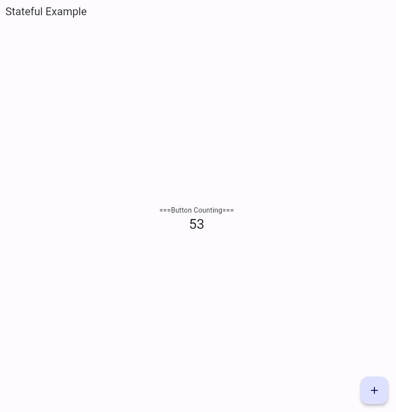

# Flutter
`Flutter`는 Android, iOS 앱을 구축할 수 있는 2018년에 출시된 Google의 모바일 UI 프레임워크 SDK입니다. 언어는 `Dart`를 사용합니다.

Flutter는 다음과 같은 이점이 있습니다.
- 단일 코드베이스
- 네이티브 앱
- 유연한 UI
- 재사용 가능한 로직
- 높은 호환성
- 고성능 및 빠른 개발
- 적은 시스템 리소스 소모
- Hot Reload (컴파일 없이 변경사항 확인 가능)

## Architecture
### 위젯 (Widget)
`위젯(Widget)`은 Flutter 애플리케이션을 구성하는 기본 요소입니다. 모든 Flutter 애플리케이션은 트리 구조의 위젯들로 구성되어 있으며, 위젯은 또다른 위젯으로 구성될 수 있습니다. 위젯에서 UI와 애플리케이션의 속성을 설정할 수 있습니다.

### 레이어 (Layer)
Fluttet 프레임워크는 복잡성에 따라 간단하게 3가지 `레이어(Layer)`로 분류할 수 있습니다. (아래로 갈수록 복잡도가 감소합니다.)
1. OS (Android / iOS)
2. 기본 Flutter 위젯
3. 표시되는 UI / 상태 렌더링

### 제스처 (Gesture)
`제스처(Gesture)`는 Flutter 애플리케이션과 관련된 모든 물리적 형태의 상호 작용(탭, 드래그 등)을 처리하는 보이지 않는 위젯입니다.

### 상태 (State)
`상태(State)`는 위젯의 속성이 가지고 있는 개체의 데이터를 저장하는 클래스입니다. Flutter 애플리케이션의 상태가 변경될 때마다 해당 상태와 관련된 위젯이 다시 렌더링됩니다.

### 라우트 (Route)
`라우트(Route)`는 Flutter 애플리케이션에서 페이지(page)입니다.

### 네비게이터 (Navigator)
`네비게이터(Navigator)`는 Route간 이동을 처리하는 위젯입니다. Navigator는 Route들을 스택(stack) 구조로 관리합니다.

## Widget
### Stateless Widget
- `Stateless Widget`은 런타임 중간에 상태를 변경할 수 없는 위젯입니다. 즉, 빌드 이후에는 상태가 변경되지 않습니다.
- `Stateless Widget`은 `build()` 메소드를 오버라이드해야 합니다. 이 메소드는 `BuildContext`을 인자로 하며, 위젯을 반환합니다. 여기서 `BuildContext`은 위젯 트리 내에서 위젯을 찾는데 사용됩니다.
- 아이콘, 텍스트 등이 `Stateless Widget`에 해당됩니다.

```
import 'package:flutter/material.dart';

void main() => runApp(const MyApp());

class MyApp extends StatelessWidget {
	const MyApp({Key? key}) : super(key: key);
	
	@override
	Widget build(BuildContext context) {
		return Container();
	}
}
```

### Stateful Widget
- `Stateful Widget`은 빌드 이후에도 상태가 변경될 수 있는 위젯입니다.
- `Stateful Widget`은 `createState()` 메소드를 오버라이드해야 합니다. 이 메소드는 상태를 반환합니다.
- `State`은 위젯의 속성이 가지고 있는 개체의 데이터를 저장합니다.
- `State`은 `build()` 메소드를 오버라이드해야 합니다. (`Stateless Widget`의 `build()`와 같습니다.)
- `State.setState` 메소드는 호출될 때 해당 `State`의 내부 상태가 변경되었음을 프레임워크에 통지합니다.

```
import 'package:flutter/material.dart';
 
void main() => runApp(const MyApp());

class MyApp extends StatefulWidget {
	const MyApp({Key? key}) : super(key: key);
 
	@override
 	_MyAppState createState() => _MyAppState();
}
 
class _MyAppState extends State<MyApp> {
	@override
 	Widget build(BuildContext context) {
		return Container();
	}
}
```

### Scaffold
- `Scaffold`는 앱의 기본 디자인 레이아웃을 제공하는 위젯입니다.

```
|-----------------|
|    appbar       |
|-----------------|
|                 |
|    content      |
|                 |
|                 |
|           float |
|-----------------|
| bottomBar       |
|-----------------|
```

|파라미터|타입|의미|
|---|---|---|
|appbar|PreferredSizeWidget|상단 바|
|body|Widget|주 내용|
|floatingActionButton|Widget|우측 하단 코너의 버튼|
|drawer|Widget|슬라이드 메뉴/패널|
|bottomNavigationBar|Widget|하단 메뉴|
|backgroundColor|Color|스캐폴드 배경색|

```
Scaffold(
	backgroundColor: const Color.fromARGB(255, 217, 249, 255),
	appBar: AppBar(
		...
	),
	body: const Center(
		child: Text(...)
	),
)
```

### MaterialApp
- `MaterialApp`은 `매터리얼 위젯(Material widget)`들을 감싸는(wrap) 위젯입니다. `MaterialApp`을 통해서 `MaterialApp`의 하위 위젯에 접근할 수 있습니다.
- 일부 위젯은 `MaterialApp`을 조상 위젯으로 요구합니다. (ex. `Scaffold`)

|파라미터|타입|의미|
|---|---|---|
|home|Widget|앱의 기본 루트(default route)일 때 표시되는 위젯|
|title|String|디바이스에 표시되는 앱의 1줄 설명문|
|color|Color|애플리케이션 색|
|debugShowCheckedModeBanner|bool|디버그시 앱 상단 DEBUG 배너 표시 유무|

```
MaterialApp(
	debugShowCheckedModeBanner = false,
	title: 'MyApp',
	home: Scaffold(
		...
	),
)
```

### AppBar
- `AppBar`는 앱 상단 메뉴를 표시하는 위젯입니다.
- `Scaffold`의 `appBar` 파라미터에 적용할 수 있습니다.

|파라미터|타입|의미|
|---|---|---|
|backgrounColor|Color|메뉴바 색상|
|leading|Widget|title 이전에 표시되는 위젯|
|title|Widget|메뉴바 제목으로 표시되는 위젯|

```
AppBar(
	leading: const Icon(Icons.menu),
	backgroundColor: Colors.blue,
	title: const Text(
	    "MyApp",
		textAlign: TextAlign.start,
	),
)
```

### BottomNavigationBar
- `BottomNavigationBar`는 앱 하단 메뉴를 표시하는 위젯입니다.
- `Scaffold`의 `bottomNavigationBar` 파라미터에 적용할 수 있습니다.

|파라미터|타입|의미|
|---|---|---|
|backgrounColor|Color|메뉴바 색상|
|currentIndex|int|현재 아이템 인덱스|
|iconSize|double|아이콘 크기|
|selectedFontSize|double|선택된 아이템 폰트 크기|
|selectedIconColor|Color|선택된 아이템 색상|
|items|List\<BottomNavigationBarItem\>|메뉴 아이템 목록|
|onTap|ValueChanged\<int\>|아이템을 선택할 때 호출되는 메소드|

```
bottomNavigationBar: BottomNavigationBar(
	items: const <BottomNavigationBarItem>[
		BottomNavigationBarItem(
			icon: Icon(Icons.home),
			label: 'Home',
		),
		BottomNavigationBarItem(
			icon: Icon(Icons.business),
			label: 'Business',
		),
		BottomNavigationBarItem(
			icon: Icon(Icons.school),
			label: 'School',
		),
	],
	currentIndex: _selectedIndex,
	selectedItemColor: Color.fromARGB(255, 79, 205, 255),
	onTap: _onItemTapped,
)
```

### Drawer
- `Drawer`는 `Scaffold` 모서리에서 수평으로 슬라이드하면 나타나는 매터리얼 디자인 패널 위젯입니다.
- Scaffold의 `drawer` 파라미터에 적용할 수 있습니다.

|파라미터|타입|의미|
|---|---|---|
|child|Widget|하위 위젯|

```
Drawer(
	child: ListView(
		...
	),
)
```

### ClipRect
- `ClipRect`는 사각형 클립을 제공하는 위젯입니다.

|파라미터|타입|의미|
|---|---|---|
|child|Widget|하위 위젯|

```
ClipRect(
	child: Container(
		height: 200,
		width: 200,
		color: Colors.yellow,
	),
)
```

### ClipRRect
- `ClipRRect`는 모서리가 둥근 사각형 클립을 제공하는 위젯입니다.

|파라미터|타입|의미|
|---|---|---|
|child|Widget|하위 위젯|
|borderRadius|BorderRadiusGeometry|모서리 반지름|

```
ClipRRect(
	child: Container(
		height: 200,
		width: 200,
		color: Colors.yellow,
	),
	borderRadius: BorderRadius.circular(30.0),
)
```

### Opacity
- `Opacity`는 투명도를 제공하는 위젯입니다.
- 투명도 값 범위는 \[0.0, 1.0\]입니다.

|파라미터|타입|의미|
|---|---|---|
|child|Widget|하위 위젯|
|opacity|double|투명도|

```
Opacity(
	child: FlutterLogo(size: 150.0),
	opacity: 0.5,
)
```

### Text
- `Text`는 텍스트를 제공하는 위젯입니다.

```
Text('Hello World!')
```

### RichText
- `RichText`는 텍스트를 꾸미는 위젯입니다.

|파라미터|타입|의미|
|---|---|---|
|text|InlineSpan|텍스트 위젯|
|textAlign|TextAlign|텍스트 정렬 방식|
|textDirection|TextDirection|텍스트 방향|
|selectionColor|Color|텍스트 선택시 색상|
|maxLines|int|텍스트 최대 라인 개수|

```
RichText(
	text: const TextSpan(text: 'Hello'),
	selectionColor: const Colors.blue,
)
```

### Builder
- `Builder` 위젯은 `StatelessWidget`을 정의하는 또 다른 방법입니다.

-  `Center` 위젯 내부에서 `StatelessWidget`을 사용한다고 합시다.
```
class Foo extends StatelessWidget {
	const Foo({super.key});
	@override
	Widget build(BuildContext context) => const Text('foo');
}
...
const Center(child: Foo())
```

- 이는 `Builder`를 사용해서 다음과 같이 대체할 수 있습니다. (`StatelessWidget`을 별도로 정의하지 않고 바로 사용할 수 있습니다.)
```
Center(
	child: Builder(
		builder: (BuildContext context) => const Text('foo'),
	),
)
```

### Function
- `Function`은 함수 클래스이며, 모든 함수 타입의 최상위 객체입니다.
- `Function` 자체에는 아무런 값을 가지지 않습니다.
- 함수 타입을 저장하는 프로퍼티는 저장할 함수의 반환 타입, 파라미터 타입과 이름, 제너릭 타입을 선언해야 합니다.
	- 반환 타입이 void면 타입 표기를 생략할 수 있습니다.
	- 파라미터의 이름은 생략 가능합니다.

```
void foo1() {};
int foo2(int a, int b) { return a + b; };

Function() f1 = foo1;
int Function(int a, int b) f2 = foo2;
```

- 프로퍼티의 타입을 `Function`만으로 표기하는 경우, 모든 함수를 담을 수 있습니다.
- 그러나 이 프로퍼티를 통해 함수를 호출할 수 없습니다.
	- 단, static 타입 값을 다루는 함수는 호출 가능합니다.

```
Function foo = (int n) => "$n";
print(foo(1)); // 정상적으로 동작합니다.
```

## Layout
### Container
- `Container`는 위젯의 UI, 위치, 크기를 제어하는 위젯입니다.
- Container의 구조는 `HTML`의 `Box Model`하고 유사합니다.

```
|-Container----------------------------|
|    margin                            |
|     |--border--------------------|   |
|     |      padding               |   |
|     |           child            |   |
|     |                            |   |
|     |----------------------------|   |
|                                      |
|--------------------------------------|
```

|파라미터|타입|의미|
|---|---|---|
|child|Widget|하위 위젯|
|color|Color|컨테이너 배경색|
|width|double|컨테이너 너비|
|height|double|컨테이너 높이|
|margin|EdgeInsetsGeometry|컨테이너를 둘러싼 여백|
|padding|EdgeInsetsGeometry|border와 child간 여백|

```
Container(
	height: 200,
	width: 200,
	color: Colors.yellow,
)
```

### Padding
- `Padding`은 padding을 제공하는 위젯입니다.
- `Padding`은 `Container.padding`과 동일한 동작을 합니다. 실제로 `Container`에서 `padding` 프로퍼티를 설정하면 `Container`는 `Padding` 위젯을 빌드합니다.

|파라미터|타입|의미|
|---|---|---|
|child|Widget|하위 위젯|
|padding|EdgeInsetsGeometry|border와 child간 여백|

```
Padding(
	padding: EdgeInsets.all(16.0),
	child: Text('Hello World!'),
)
```

### Expanded
- `Expanded`는 flex 레이아웃을 제공하는 위젯입니다.
- flex 레이아웃은 해당 위젯의 크기를 스크린 끝까지 자동으로 맞춰줍니다.
- 여러 아이템들이 행 또는 열을 이룰 때, flex 값은 각 아이템들이 상대적으로 차지하는 공간을 결정합니다. 만약 아이템 A의 flex가 2, 아이템 B의 flex가 1이면, A와 B는 2:1 크기 비율로 공간을 차지합니다.

```
A.flex = 2, B.flex = 1
|----A----|--B--|
```

|파라미터|타입|의미|
|---|---|---|
|flex|int|flex 값|
|child|Widget|하위 위젯|

```
Expanded(
	flex: 2,
	child: Container(
		color: Colors.amber,
		height: 100,
	),
 )
```

### Column
- `Column`은 수직 방향으로 하위 위젯들을 나열하는 위젯입니다.

|파라미터|타입|의미|
|---|---|---|
|children|List<Widget>|하위 위젯 목록|

```
Column(
	children: <Widget>[
		...
	],
)
```

### Row
- `Row`은 수평 방향으로 하위 위젯들을 나열하는 위젯입니다.

|파라미터|타입|의미|
|---|---|---|
|children|List<Widget>|하위 위젯 목록|

```
Row(
	children: <Widget>[
		...
	],
)
```

### Stack
- `Stack`은 모서리를 기준으로 하위 위젯들을 배치하는 위젯입니다.

|파라미터|타입|의미|
|---|---|---|
|children|List<Widget>|하위 위젯 목록|

```
Stack(
	children: <Widget>[
		...
	],
)
```

### Positioned
- `Positioned`은 `Stack` 내부에서 하위 위젯의 위치를 조정하는 위젯입니다.
- 상대 위치는 `Stack`의 모서리를 기준으로 합니다.

|파라미터|타입|의미|
|---|---|---|
|child|Widget|하위 위젯|
|left|double|왼쪽 모서리간 거리|
|right|double|오른쪽 모서리간 거리|
|top|double|위쪽 모서리간 거리|
|bottom|double|아래쪽 모서리간 거리|
|width|double|`child` 너비|
|height|double|`child` 높이|

```
Stack(
	children: <Widget>[
		Positioned(
			left: 40,
			top: 30,
			child: Container(
				...
			),
		),
	],
)
```

### EdgeInsets
- `EdgeInsets`은 4개의 값을 제공하는 클래스입니다.
- 주로 사각형과 관련된 프로퍼티에서 값으로 사용됩니다. (ex. padding)

1. 전체
> EdgeInsets.all(8.0)

2. 수직-수평
> EdgeInsets.symmetric(vertical: 8.0, horizontal: 12.0)

3. 상-하-좌-우
> EdgeInsets.only(left: 8.0, right: 10.0, top: 12.0, bottom: 14.0)

## UI Components
### AlertDialog
- `AlertDialog`는 경고 메시지 창을 표시하는 위젯입니다.

|파라미터|타입|의미|
|---|---|---|
|actions|List\<Widget\>|창 하단에 표시되는 액션 목록|
|title|Widget|창 상단에 표시되는 제목|
|content|Widget|창 메시지 내용|

```
AlertDialog(
	title: const Text("Alert Dialog Box"),
	content: const Text("This is Alert Dialog Box"),
	actions: <Widget>[
		TextButton(
			onPressed: () {
				Navigator.of(ctx).pop();
			},
            child: Container(
                color: Color.fromARGB(255, 204, 253, 255),
                padding: const EdgeInsets.all(14),
                child: const Text("ok"),
			),
		),
	],
)
```

### SimpleDialog
- `SimpleDialog`는 여러 선택지를 포함한 메시지 창을 표시하는 위젯입니다.

|파라미터|타입|의미|
|---|---|---|
|actions|List\<Widget\>|선택지 목록|
|title|Widget|창 상단에 표시되는 제목|

```
SimpleDialog(
	title:const Text('Simple Dialog Box'),
	children: <Widget>[
		SimpleDialogOption(
			onPressed: () { },
			child:const Text('Option 1'),
		),
		SimpleDialogOption(
			onPressed: () { },
			child: const Text('Option 2'),
		),
	],
)
```

### showDialog
- `showDialog`는 Dialog를 표시해주는 함수입니다. `AlertDialog`, `SimpleDialog`를 사용하려면 `showDialog`을 호출하면 됩니다.

|파라미터|타입|의미|
|---|---|---|
|context|BuildContext|`showDialog`를 호출한 위젯의 BuildContext|
|Builder|WidgetBuilder|빌드 메소드|

```
showDialog(
	context: context,
	builder: (BuildContext context) {
		return Expanded(
	        child: AlertDialog(
	            ...
			),
		);
	},
)
```

### Icon
- `Icon`은 아이콘을 관리하는 위젯입니다.
- `Icon` 생성자의 1번째 파라미터는 아이콘 종류를 인자로 합니다.  아이콘 종류는 `Icons`에서 가져올 수 있습니다.

|파라미터|타입|의미|
|---|---|---|
|size|double|아이콘 크기|
|color|Color|아이콘 색|

```
Icon(
	Icons.favorite,
	color: Colors.yellow,
	size: 20.0,
)
```

### CircularProgressIndicator
- `CircularProgressIndicator`는 원형 모양의 진행도를 표시하는 위젯입니다.
- 진행도 위젯은 2가지 타입을 가지고 있습니다.
	- `indeterminate`: 진행도가 특정 값을 가지지 않습니다. (진행 상태만 파악할 수 있습니다.)
	- `determinate`: 진행도가 특정 값을 가집니다. 진행도 값 범위는 \[0.0, 1.0\]입니다.

|파라미터|타입|의미|
|---|---|---|
|backgroundColor|Color|도형 색|
|strokeWidth|double|도형 두께|
|value|dobule|값이 `null`이면 `indeterminate`, 그렇지 않으면 `determinate`|

```
CircularProgressIndicator(
	backgroundColor: Colors.blue,
	strokeWidth: 10,
	value: null,
)
```

### LinearProgressIndicator
- `LinearProgressIndicator`는 선형 모양의 진행도를 표시하는 위젯입니다.
- 이 외는 `CircularProgressIndicator`와 동일합니다.

```
LinearProgressIndicator(
	backgroundColor: Colors.green,
	strokeWidth: 10,
	value: null,
)
```

### DefaultTabController
- `DefaultTabController`는 탭 목록을 관리하는 위젯입니다.

|파라미터|타입|의미|
|---|---|---|
|child|Widget|하위 위젯|
|length|int|탭 개수|

```
DefaultTabController(
	length: 5,
	child: Scaffold(
		appBar: AppBar(
			bottom: const TabBar(
				tabs: [
					Tab(icon: Icon(Icons.music_note)),
					Tab(icon: Icon(Icons.music_video)),
					Tab(icon: Icon(Icons.camera_alt)),
					Tab(icon: Icon(Icons.grade)),
					Tab(icon: Icon(Icons.email)),
				],
			),
		),
	),
)
```

### TabBar
- `TabBar`는 탭 목록을 표시하는 위젯입니다.
- `DefaultTabController`의 `child`에 `TabBar`를 추가해서 탭 목록을 앱에 넣을 수 있습니다.

|파라미터|타입|의미|
|---|---|---|
|tabs|List\<Widget\>|탭 위젯|

### ListView
- `ListView`는 스크롤 가능한 리스트를 표시하는 위젯입니다.
- 일반적으로 `ListView`의 `child` 위젯은 스크린에 표시될 때만 오브젝트가 존재합니다. 즉, `ListView` 아이템이 스크롤되어 스크린에 표시되면 해당 아이템의 오브젝트가 생성되고, 스크린에서 사라지면 해당 오브젝트가 소멸됩니다.
- `ListView`의 기본 생성자는 사용 가능한 모든 아이템을 한꺼번에 빌드를 수행합니다. 리스트의 아이템 개수가 적다면 기본 생성자가 적합합니다.
	- `children` 파라미터를 통해 모든 아이템을 나열합니다.

|파라미터|타입|의미|
|---|---|---|
|children|List\<Widget\>|리스트 아이템 목록|
|scrollDirection|Axis|스크롤 방향|
|padding|EdgeInsetsGeometry|아이템간 간격|

```
ListView(
	scrollDirection: Axis.horizontal,
	padding: const EdgeInsets.all(4),
	children: <Widget>[
		Container(
			...
		),
		Container(
			...
		),
	],
)
```

- `ListView.builder` 생성자는 실제로 스크린에 표시되는 아이템만 빌드합니다. 리스트 아이템 개수가 많다면 `builder` 생성자가 적합합니다.
	- `itemBuilder` 파라미터를 통해 아이템 틀을 작성합니다. `itemBuilder`는 함수를 값으로 하며, 이 함수는 `BuildContext`와 현재 아이템의 인덱스를 의미하는 `int` 파라미터를 갖습니다.

|파라미터|타입|의미|
|---|---|---|
|itemCount|int|아이템 개수|
|scrollDirection|Axis|스크롤 방향|
|padding|EdgeInsetsGeometry|아이템간 간격|

```
ListView.builder(
	padding: const EdgeInsets.all(8),
	itemCount: 10,
	itemBuilder: (BuildContext context, int index) {
		return Container(
			...
		);
	}
)
```

## Design & Animations
### AnimationController
- `AnimationController`은 애니메이션을 제어하는 위젯입니다.
- `AnimationController`는 `TickerProvider` 오브젝트를 사용합니다. `TickerProvider`는 `Ticker` 오브젝트와 인터페이스하는 클래스이며, `Ticker`는 애니메이션 프레임마다 콜백을 한번씩 호출하는 클래스입니다.
- 만약 `AnimationController`가 상태 클래스에서 생성된다면, 해당 상태는 `TickerProvider`가 구현된 `TickerProviderStateMixin`을 사용할 수 있습니다.
- `AnimationController` 오브젝트는 더 이상 사용되지 않는다면 자원 절약을 위해 소멸되어야 합니다. 만약 `StatefulWidget`을 사용한다면, 보통 `AnimationController`는 상태가 `State.initState`일 때 생성되고 `State.dispose`일 때 소멸되는 것이 일반적입니다.

|파라미터|타입|의미|
|---|---|---|
|duration|Duration|애니메이션 지속 시간|
|vsync|TickerProvider|사용할 `TickerProvider`|

```
AnimationController(
	duration: const Duration(seconds: 3),
	vsync: this,
)
```

### Animation<T>
- `Animation<T>`는 `T` 타입으로 구성된 애니메이션 추상 클래스입니다.

### CurvedAnimation
- `CurvedAnimation`는 커브 애니메이션이 적용된 애니메이션 클래스입니다.

|파라미터|타입|의미|
|---|---|---|
|parent|Animation\<double\>|커브 애니메이션을 적용할 `Animation`|
|curve|Curve|커브 오브젝트|

```
CurvedAnimation(
	parent: _controller,
	curve: Curves.elasticIn,
)
```

### SlideTransition
- `SlideTransition`은 아이템의 위치 애니메이션을 수행하는 위젯입니다.

|파라미터|타입|의미|
|---|---|---|
|child|Widget|하위 위젯|
|position|Animation\<Offset\>|`child`의 위치를 제어하는 애니메이션|

```
SlideTransition(
	position: Tween<Offset>(
		begin: Offset.zero,
		end: const Offset(1.5, 0.0),
	).animate(CurvedAnimation(
		...
	)),
	child: const Padding(
		...
	),
)
```

### RotationTransition
- `RotationTransition`은 아이템의 회전 애니메이션을 수행하는 위젯입니다.

|파라미터|타입|의미|
|---|---|---|
|child|Widget|하위 위젯|
|turns|Animation\<double\>|`child`의 회전을 제어하는 애니메이션|

```
RotationTransition(
	turns: Tween(
		begin: 0.0,
		end: 0.15,
	).animate(CurvedAnimation(
		...
	)),
	child: const Padding(
		...
	),
)
```

### FlutterLogo
- `FlutterLogo`는 Flutter의 로고 이미지를 포함한 위젯입니다.

|파라미터|타입|의미|
|---|---|---|
|size|double|로고 크기|

```
FlutterLogo(
	size: 150.0
)
```

### Material
- `Material` 위젯은 Clipping, Elevation, Ink 등을 사용할 때 이들의 조상 위젯 역할을 합니다.

|파라미터|타입|의미|
|---|---|---|
|child|Widget|하위 위젯|
|color|Color|배경 색|
|animationDuration|Duration|애니메이션 지속 시간|

```
Material(
	color: Colors.yellow,
	child: InkWell(
		...
	),
)
```

### AnimatedContainer
- `AnimatedContainer`는 `Container`에서 애니메이션을 포함한 위젯입니다.
- `AnimatedContainer`의 내부에는 자체`AnimationController`가 포함되어 있습니다.

|파라미터|타입|의미|
|---|---|---|
|child|Widget|하위 위젯|
|width|double|너비|
|height|double|높이|
|duration|Duration|애니메이션 지속 시간|
|curve|Curve|커브 오브젝트|
```
AnimatedContainer(
	height: 50,
	width: 50,
	duration: const Duration(seconds: 2),
	curve: Curves.easeIn,
	child: Material(
		...
	),
)
```

### Tween<T>
- `Tween<T>`은 `T` 타입에 대해 시작에서 종료까지 선형 차이를 의미하는 클래스입니다.
- `Tween<T>`은 주로 애니메이션에서 사용됩니다.
- `animate` 메소드는 `Animation<T>`를 반환합니다.

|프로퍼티|타입|의미|
|---|---|---|
|begin|`T`|시작 값|
|end|`T`|종료 값|

```
Tween<Offset>(
	begin: const Offset(0.0, 0.0),
	end: const Offset(50.0, 100.0),
)
```

### Offset
- `Offset`은 2D 좌표에서 변화량을 의미하는 클래스입니다.

```
Offset(double dx, double dy)
```

### InkWell
- `InkWell`은 터치 제스처에 반응하는 직사각형 영역의 매터리얼 위젯입니다.
- `InkWell`을 사용하려면 `Material` 위젯을 조상 위젯으로 해야 합니다.

```
InkWell(
	onTap: () {
		setState(() {
			sideLength == 50 ? sideLength = 100 : sideLength = 50;
		});
	},
)
```

### GridView
- `GridView`는 스크롤이 가능한 2D 그리드 레이아웃 위젯입니다.
- `GridView`에서 가장 자주 사용되는 생성자는 타일 개수가 고정된 그리드를 생성하는 `GridView.count`입니다.

|파라미터|타입|의미|
|---|---|---|
|primary|bool|상위 스크롤 뷰 사용 유무|
|padding|EdgeInsetsGeometry|그리드 바깥 여백 간격|
|crossAxisSpacing|double|아이템간 간격(세로)|
|mainAxisSpacing|double|아이템간 간격(가로)|
|crossAxisCount|double|세로 줄 개수|
|children|List\<Widget\>|아이템 목록|

```
GridView.count(
	primary: false,
	padding: const EdgeInsets.all(20),
	crossAxisSpacing: 10,
	mainAxisSpacing: 10,
	crossAxisCount: 2,
	children: <Widget>[
		Container(
			...
		),
		Container(
 			...
		),
	],
)
```

### ThemeData
- `ThemeData`는 테마를 정의하는 위젯입니다.
- `MaterialApp`의 `theme`, `Theme`의 `data` 등에서 값으로 사용됩니다.
- `ThemeData.copyWith` 메소드는 테마 오브젝트를 복사합니다. (인자를 제공해서 원하는 파라미터를 수정할 수 있습니다.)

|파라미터|타입|의미|
|---|---|---|
|brightness|Brightness|밝기 테마|
|primaryColor|Color|앱의 주요 부분의 배경 색|

```
ThemeData(
	brightness: Brightness.light,
	primaryColor: Colors.green,
)
```

### Theme
- `Theme`는 후손 위젯에게 테마를 적용하는 위젯입니다.
- `of` 정적 메소드는 주어진 `BuildContext`와 가장 가까운 테마 오브젝트를 반환합니다.

|파라미터|타입|의미|
|---|---|---|
|data|ThemeData|테마 값|
|child|Widget|하위 위젯|

```
Theme(
	data: Theme.of(context).copyWith(
		colorScheme: Theme.of(context).colorScheme,
	),
	child: Container(
		...
	),
)
```

## Form
### Form
- `Form` 위젯은 폼과 관련된 위젯들의 조상 위젯 역할을 합니다.

|파라미터|타입|의미|
|---|---|---|
|child|Widget|하위 위젯|

```
Form(
	key: _formKey,
	child: Column(
		...
	),
)
```

### FormField
- `FormField`는 폼 필드를 제공하는 위젯입니다.
- `Form` 위젯 내부에 있으면 `FormState`의 메소드를 사용할 수 있습니다. (상태 정보 저장, 리셋, 유효성 검사 등)
- `GlobalKey`를 사용하면 `FormField`에 저장된 상태 정보를 다른 필드에서도 가져올 수 있습니다.

### TextField
- `TextField`는 텍스트를 입력할 수 있는 박스를 제공하는 위젯입니다.
- `onSubmitted` 콜백의 인자의 값은 입력된 텍스트입니다.

|파라미터|타입|의미|
|---|---|---|
|controller|TextEditingController|텍스트 수정을 제어하는 컨트롤러|
|onSubmitted|ValueChanged\<T\>|텍스트 제출시 호출되는 콜백|

```
TextField(
	controller: _controller,
	onSubmitted: (String value) async {
		// value = 입력된 텍스트 값
		...
	},
)
```

### TextFormField
- `TextFormField`는 `TextField`를 포함한 `FormField` 위젯입니다.
- `validator` 콜백은 유효성 검사할 때 호출되는 함수입니다.
	- 이 콜백의 인자는 입력된 텍스트를 값으로 합니다.
	- 오류가 발생하면, 오류 메시지를 반환합니다. 오류가 없다면 null을 반환합니다.

|파라미터|타입|의미|
|---|---|---|
|decoration|InputDecoration|텍스트 데코레이션|
|validator|FormFieldValidator\<String\>|유효성 검사 콜백|

```
TextFormField(
	decoration: const InputDecoration(
		hintText: 'Enter your ID',
	),
	validator: (String? value) {
		if (value == null || value.isEmpty) {
			return 'empty text';
		}
		return null;
	},
)
```

## Gesture
### GestureDetector
- `GestureDetector`는 제스처를 감지하는 위젯입니다.
- `child` 내에서 특정 제스처를 감지하면 알맞은 콜백을 호출합니다. (각 제스처에 대한 콜백은 파라미터를 통해 설정할 수 있습니다.)

|파라미터|타입|의미|
|---|---|---|
|child|Widget|하위 위젯|

```
GestureDetector(
	onTap: () {
		setState(() {
			_lightIsOn = !_lightIsOn;
		});
	},
	child: Container(
		child: Text(_lightIsOn ? 'TURN LIGHT OFF' : 'TURN LIGHT ON'),
	),
)
```
- `GestureDetector`에서 제스처 콜백 종류는 다음이 있습니다.

#### Tap
- onTapDown
- onTapUp
- onTap
- onTapCancel

#### Double tap
- onDoubleTap

#### Long press
- onLongPress

#### Vertical Drag
- onVerticalDragStart
- onVerticalDragUpdate
- onVerticalDragEnd

#### Horizontal Drag
- onHorizontalDragStart
- onHorizontalDragUpdate
- onHorizontalDragEnd

## Key
- Key는 위젯을 식별하는 용도로 사용됩니다.
- 일반적인 `StatefulWidget`은 Key를 저장하는 `key` 프로퍼티를 가지고 있습니다.
- 보통 Key는 자주 쓰이지는 않습니다. 그러나 `StatefulWidget`의 순서나 개수를 변경할 때 Key가 사용됩니다.

### Widget-Element Matching
- Fluter에서 위젯들은 트리 구조로 구성되어 있으며, Element 역시 트리 구조를 이룹니다. 만약 위젯 트리에서 업데이트가 발생하면, Element 트리에서도 업데이트가 발생합니다.
- Flutter가 Element 트리를 참조할 때, 각 Element가 알맞은 위젯과 대응되었는지 확인합니다. `StatelessWidget`일 경우 Type만 확인하며, `StatefulWidget`일 경우 Type과 Key 모두를 확인합니다.
```
Widget Tree            Element Tree

Row                    Row
|                      |
|-- Tile(Key:1)        |-- Tile(Key:1) -- State A
|                      |
|-- Tile(Key:2)        |-- Tile(Key:2) -- State B
```

- 위젯 트리에서 `Row`의 두 하위 위젯 순서를 바꿔봅시다. Flutter가 Element 트리를 탐색하면서 각 Element가 알맞은 위젯에 대응되었는지 확인합니다. 아래 예시에선 Type은 일치하나, Key는 일치하지 않습니다.
```
Widget Tree            Element Tree

Row                    Row
|                      |
|-- Tile(Key:2)        |-- Tile(Key:1) -- State A
|                      |
|-- Tile(Key:1)        |-- Tile(Key:2) -- State B
```

- 불일치한 Element는 비활성되고 Element 트리에서 삭제됩니다. 이후, Flutter는 위젯 트리의 알맞은 레벨로 이동하여 적합한 위젯이 있는지를  탐색합니다.
	- 알맞은 위젯을 찾으면, 해당 위젯과 Element를 대응하고 Element 트리를 업데이트합니다.
	- 알맞은 위젯을 찾지 못하면, 해당 위젯에 대응하는 새로운 Element를 생성합니다.
- 아래 예시에는 적합한 위젯이 존재하므로, 각 Element가 알맞은 위젯과 매칭됩니다. (만약 key가 없다면 타입만 비교될 것이며, Element의 순서가 바뀌지 않을 것입니다.)
```
Widget Tree            Element Tree

Row                    Row
|                      |
|-- Tile(Key:2)        |-- Tile(Key:2) -- State B
|                      |
|-- Tile(Key:1)        |-- Tile(Key:1) -- State A
```

- Flutter의 위젯-Element 매칭 알고리즘은 트리의 레벨 단위로 진행됩니다.
- 탐색은 트리의 최상단부터 시작하며, 레벨 단위로 탐색합니다. (정확히는 동일한 부모 노드를 가지는 노드 집합을 탐색 단위로 합니다.) 불일치한 Element를 발견할 때 알맞은 위젯을 찾는 과정도 마찬가지입니다.
- 위 예제에서 각 타일이 `Container` 위젯으로 감싸진 상태에서 `Tile`의 순서를 바꿔봅시다. (Key는 `LocalKey`로 가정합니다.)
```
Widget Tree             Element Tree

Row                     Row
|                       |
| -- Container          | -- Container
|    |-- Tile(Key:2)    |    |-- Tile(Key:1) -- State A
|                       |
| -- Container          | -- Container
     |-- Tile(Key:1)         |-- Tile(Key:2) -- State B
```

- 이번에는 각 Element에 대해 알맞은 위젯을 찾지 못합니다. 따라서 새로운 Element가 생성됩니다. (기존 `State` 정보가 초기화됩니다.)
```
Widget Tree             Element Tree

Row                     Row
|                       |
| -- Container          | -- Container
|    |-- Tile(Key:2)    |    |-- Tile(Key:2) -- State C
|                       |
| -- Container          | -- Container
     |-- Tile(Key:1)         |-- Tile(Key:1) -- State D
```

- 문제를 해결하려면 Key는 유지해야 하는 상태 정보가 있는 최상단 위젯에 추가되어야 합니다.
- 아래 예제에서 `Container`에 Key를 등록하면 문제가 해결됩니다.
```
Widget Tree             Element Tree

Row                     Row
|                       |
| -- Container(Key:2)   | -- Container(Key:2)
|    |-- Tile           |    |-- Tile -- State B
|                       |
| -- Container(Key:1)   | -- Container(Key:1)
     |-- Tile                |-- Tile -- State A
```

### GlobalKey
- `GlobalKey`는 앱 전체에서 고유한 Key를 가지는 Key 클래스입니다.
- `GlobalKey`은 주로 다음 용도로 사용됩니다.
	- 정보를 유지하며 위젯의 부모를 변경할 수 있습니다.
	- 어떤 위젯의 정보를 다른 위젯 트리에서 접근할 수 있습니다.
- 일반적으로 `GlobalKey`를 갖는 Element를 매칭할 때는 `LocalKey`에 비해 비용이 비쌉니다.

### LocalKey
- `LocalKey`는 `GlobalKey`가 아닌 Key 클래스입니다.
- `LocalKey`의 Key는 같은 부모 노드를 가지는 위젯 집합 내에서만 유일성을 갖습니다.

## Navigator
### Route
- `Route`는 `Navigator`에서 아이템인 추상 클래스입니다.

### MaterialPageRoute
- `MaterialPageRoute`은 모달(Modal) Route 클래스입니다.
- 기본적으로 플랫폼 친화적인 트랜지션(transition)이 적용되어 있습니다.

### Navigator
- `Navigator`는 `Route` 위젯들을 스택 구조로 관리하는 위젯입니다.
- 대부분의 앱에서 네비게이터는 위젯 트리의 최상단에 위치합니다.

#### 페이지 추가
- `Navigator.push` 메소드를 사용합니다.
- `context`와 밀접한 `Navigator`에서 `route`를 가장 위쪽에 추가합니다.

> Navigator.push(BuildContext context, Route<T> route)

```
Navigator.push(context, MaterialPageRoute<void>(
    builder: (BuildContext context) {
        return Scaffold(
            appBar: AppBar(title: const Text('My Page')),
            body: Center(
                child: TextButton(
                    child: const Text('POP'),
                    onPressed: () {
                        Navigator.pop(context);
                    },
                ),
		    ),
        );
    },
));
```

- 만약 이름이 있는 Route를 추가한다면 `Navigator.pushNamed` 메소드를 사용하면 됩니다. (동작은 `Navigator.push`와 같습니다.)

> Navigator.pushNamed(`context`, `routeName`);

#### 페이지 삭제
- `Navigator.pop` 메소드를 사용합니다.
- `context`와 밀접한 `Navigator`에서 가장 위쪽에 있는 Route를 삭제합니다.

> Navigator.pop(BuildContext context)

```
Navigator.pop(context);
```

#### 페이지 이름
- Route를 관리하는 가장 쉬운 방법은 주소 형식의 이름을 사용하는 것입니다. (ex. `/menu/status`)
- 홈페이지의 주소는 보통 `/`으로 합니다.
- `MaterialApp`의 `routes` 파라미터는 `Map<String, WidgetBuilder>`을 인자로 합니다. 값을 추가하면 `MaterialApp`이 해당 `Navigator`에 주어진 Route를 추가하는 콜백을 호출합니다.

```
void main() {
    runApp(MaterialApp(
        home: const MyAppHome(),
        routes: <String, WidgetBuilder> {
            '/a': (BuildContext context) => const MyPage(title: Text('page A')),
            '/b': (BuildContext context) => const MyPage(title: Text('page B')),
            '/c': (BuildContext context) => const MyPage(title: Text('page C')),
        },
    ));
}
```

#### 페이지 반환
- `Navigator.pop`의 2번째 인자는 해당 페이지를 생성한 `Navigator.push` 메소드가 반환하는 Future의 잠재적 값이 됩니다.
- 아래 예제에서 `value`의 값은 `Navigator.pop`의 2번째 인자이며, 타입은 `Navigator.push`의 2번째 인자로 제공한 `MaterialPageRoute`의 제너릭 타입과 같습니다.

```
bool? value = await Navigator.push(context, MaterialPageRoute<bool>(
	builder: (BuildContext context) {
		return Center(
			child: GestureDetector(
				child: const Text('OK'),
				onTap: () { Navigator.pop(context, true); }
			),
		);
	}
));
```

#### 페이지 인자
- `Navigator.pushNamed`의 3번째 선택 인자 `arguments`를 통해서 페이지에 인자를 전달할 수 있습니다.
- 인자의 타입은 String, int 등이 사용됩니다. (보통 Map을 사용합니다.) 
- 전달한 인자는 해당 페이지의 생성자로 전달됩니다.

> Navigator.pushNamed(`context`, `routeName`, `arguments`);

```
class StatusRoute {
	StatusRoute({ required this.name, required this.level });
	final String name;
	final String level;
}

void navigate() {
	Navigator.pushNamed(
		context,
		'/status',
		arguments: StatusRoute(name: 'Steve', level: 5),
	);
}
```

## Example
### Stateless Widget
- 'Stateless Widget'를 출력합니다.
```
import 'package:flutter/material.dart';
void main() => runApp(const MyApp());

class MyApp extends StatelessWidget {
	const MyApp({Key? key}) : super(key: key);
  
	@override
	Widget build(BuildContext context) {
		return MaterialApp(
			debugShowCheckedModeBanner: false,
			home: Scaffold(
				backgroundColor: const Color.fromARGB(255, 217, 249, 255),
				appBar: AppBar(
					leading: const Icon(Icons.menu),
					backgroundColor: Colors.blue,
					title: const Text(
					    "MyApp",
						textAlign: TextAlign.start,
					),
				),
				body: const Center(
				child: Text(
					"Stateless Widget",
					style: TextStyle(color: Colors.black, fontSize: 30),
					),
				),
			),
		);
	}
}
```


### Stateful Widget
- 'Stateful Widget'를 출력합니다.
```
import 'package:flutter/material.dart';
void main() => runApp(const MyApp());

class MyApp extends StatefulWidget {
	const MyApp({Key? key}) : super(key: key);

	@override
	_MyAppState createState() => _MyAppState();
}

class _MyAppState extends State<MyApp> {
	@override
	Widget build(BuildContext context) {
		return MaterialApp(
			debugShowCheckedModeBanner: false,
			home: Scaffold(
				backgroundColor: const Color.fromARGB(255, 217, 249, 255),
				appBar: AppBar(
					leading: const Icon(Icons.menu),
					backgroundColor: Colors.blue,
					title: const Text(
					    "MyApp",
						textAlign: TextAlign.start,
					),
				),
				body: const Center(
				child: Text(
					"Stateful Widget",
					style: TextStyle(color: Colors.black, fontSize: 30),
					),
				),
			),
		);
	}
}
```



### AppBar
- 상단에 `AppBar`가 표시됩니다.

```
import 'package:flutter/material.dart';
void main() => runApp(const MyApp());

class MyApp extends StatelessWidget {
	const MyApp({Key? key}) : super(key: key);
  
	@override
	Widget build(BuildContext context) {
		return MaterialApp(
			home: Scaffold(
				appBar: AppBar(
					leading: const Icon(Icons.menu),
					backgroundColor: Colors.blue,
					title: const Text(
					    "MyApp",
						textAlign: TextAlign.start,
					),
				),
			),
		);
	}
}
```


### BottomNavigationBar
- 3가지 아이템(Home, Business, School)을 가지는 메뉴 바입니다.
- 메뉴 바의 아이템을 선택하면 메인 화면에 표시되는 텍스트가 달라집니다.

```
import 'package:flutter/material.dart';
void main() => runApp(const MyApp());

class MyApp extends StatefulWidget {
	const MyApp({super.key});

	@override
	State<MyApp> createState() => _MyAppState();
}

class _MyAppState extends State<MyApp> {
	int _selectedIndex = 0;
	static const List<Widget> contents = <Widget>[
		Text('0. Home'),
		Text('1. Business'),
		Text('2. School'),
	];

	void _onItemTapped(int index) {
		setState(() {
			_selectedIndex = index;
		});
	}

	@override
	Widget build(BuildContext context) {
		return MaterialApp(
			home: Scaffold(
				body: Center(child: contents[_selectedIndex]),
				bottomNavigationBar: BottomNavigationBar(
					items: const <BottomNavigationBarItem>[
						BottomNavigationBarItem(
							icon: Icon(Icons.home),
							label: 'Home',
						),
						BottomNavigationBarItem(
							icon: Icon(Icons.business),
							label: 'Business',
						),
						BottomNavigationBarItem(
							icon: Icon(Icons.school),
							label: 'School',
						),
					],
					currentIndex: _selectedIndex,
					selectedItemColor: Color.fromARGB(255, 79, 205, 255),
					onTap: _onItemTapped,
				),
			),
		);
	}
}
```


### Drawer
- 상단 버튼을 클릭하면 `Drawer`가 표시됩니다.
```
import 'package:flutter/material.dart';
void main() => runApp(const MyApp());

class MyApp extends StatelessWidget {
	const MyApp({Key? key}) : super(key: key);
 
	@override
	Widget build(BuildContext context) {
		return MaterialApp(
			home: Scaffold(
				appBar: AppBar(
					backgroundColor: Colors.green,
				),
				drawer: Drawer(
					child: ListView(
						children: [
							const DrawerHeader(
								decoration: BoxDecoration(
									color: Colors.green,
								),
								child: Text(
									"Drawer",
									style: TextStyle(fontSize: 30.0, color: Colors.white),
								),
							),
							ListTile(
								leading: const Icon(Icons.person),
								title: const Text('Profile'),
							),
							ListTile(
								leading: const Icon(Icons.book),
								title: const Text('Information'),
							),
							ListTile(
								leading: const Icon(Icons.logout),
								title: const Text('LogOut'),
							),
						],
					),
				),
			),
		);
	}
}
```


### AlertDialog
- 버튼을 누르면 `AlertDialog`을 표시합니다.

```
import 'package:flutter/material.dart';
void main() => runApp(const MyApp());

class MyApp extends StatelessWidget {
	const MyApp({Key? key}) : super(key: key);
 
	@override
	Widget build(BuildContext context) {
		return const MaterialApp(
			home: HomePage(),
		);
	}
}
 
class HomePage extends StatefulWidget {
	const HomePage({Key? key}) : super(key: key);
 
	@override
	_HomePageState createState() => _HomePageState();
}
 
class _HomePageState extends State<HomePage> {
	@override
	Widget build(BuildContext context) {
		return Scaffold(
			body: Container(
				child: Center(
					child: ElevatedButton(
						onPressed: () {
							showDialog(
								context: context,
								builder: (ctx) => AlertDialog(
									title: const Text("Alert Dialog Box"),
									content: const Text("This is Alert Dialog Box"),
							        actions: <Widget>[
						                TextButton(
							                onPressed: () {
						                        Navigator.of(ctx).pop();
						                    },
						                    child: Container(
						                        color: Color.fromARGB(255, 204, 253, 255),
						                        padding: const EdgeInsets.all(14),
						                        child: const Text("ok"),
											),
										),
									],
								),
							);
						},
						child: const Text("Show Dialog"),
					),
				),
			),
		);
	}
}
```


### AnimationController
- `CurvedAnimation`와 `SlideTransition`이 적용된 애니메이션입니다.

```
import 'package:flutter/material.dart';
void main() => runApp(const MyApp());

class MyApp extends StatefulWidget {
	const MyApp({super.key});
	
	@override
	State<MyApp> createState() => _MyApp ();
}

class _MyApp extends State<MyApp> with SingleTickerProviderStateMixin {
	late final AnimationController _controller = AnimationController(
		duration: const Duration(seconds: 3),
		vsync: this,
	)..repeat(reverse: true);
	late final Animation<Offset> _offsetAnimation = Tween<Offset>(
		begin: Offset.zero,
		end: const Offset(1.5, 0.0),
	).animate(CurvedAnimation(
		parent: _controller,
		curve: Curves.elasticIn,
	));

	@override
	void dispose() {
		_controller.dispose();
		super.dispose();
	}

	@override
	Widget build(BuildContext context) {
		return SlideTransition(
			position: _offsetAnimation,
			child: const Padding(
				padding: EdgeInsets.all(8.0),
				child: FlutterLogo(size: 150.0),
			),
		);
	}
}
```


### InkWell
- 직사각형을 터치하면 확대 / 축소됩니다.

```
import 'package:flutter/material.dart';

void main() => runApp(const MyApp());

class MyApp extends StatelessWidget {
	const MyApp({super.key});

	@override
	Widget build(BuildContext context) {
		return MaterialApp(
			home: Scaffold(
				body: const Center(
					child: InkWellExample(),
				),
			),
		);
	}
}

class InkWellExample extends StatefulWidget {
	const InkWellExample({super.key});

	@override
	State<InkWellExample> createState() => _InkWellExampleState();
}

class _InkWellExampleState extends State<InkWellExample> {
	double length = 50;

	@override
	Widget build(BuildContext context) {
		return AnimatedContainer(
			height: length,
			width: length,
			duration: const Duration(seconds: 2),
			curve: Curves.easeIn,
			child: Material(
				color: Colors.yellow,
				child: InkWell(
					onTap: () {
						setState(() {
							length == 50 ? length = 100 : length = 50;
						});
					},
				),
			),
		);
	}
}
```


### Form
- `TextFormField`를 포함한 `Form`입니다.
- ID를 입력하고 제출할 수 있습니다.
- 빈 텍스트는 제출할 수 없습니다.

```
import 'package:flutter/material.dart';

void main() => runApp(const MyApp());

class MyApp extends StatelessWidget {
	const MyApp({super.key});

	@override
	Widget build(BuildContext context) {
		return MaterialApp(
			home: Scaffold(
				appBar: AppBar(title: const Text('Form App')),
				body: const FormExample(),
			),
		);
	}
}

class FormExample extends StatefulWidget {
	const FormExample({super.key});

	@override
	State<FormExample> createState() => _FormExampleState();
}

class _FormExampleState extends State<FormExample> {
	final GlobalKey<FormState> _formKey = GlobalKey<FormState>();

	@override
	Widget build(BuildContext context) {
		return Form(
 			key: _formKey,
			child: Column(
				crossAxisAlignment: CrossAxisAlignment.start,
 				children: <Widget>[
					TextFormField(
 						decoration: const InputDecoration(
 							hintText: 'Enter your ID',
						),
						validator: (String? value) {
							if (value == null || value.isEmpty) {
								return 'Please enter some text';
							}
 							return null;
						},
					),
					Padding(
            					padding: const EdgeInsets.symmetric(vertical: 16.0),
            					child: ElevatedButton(
              						onPressed: () {
                						if (_formKey.currentState!.validate()) {
	 								// submit 완료
								}
	 						},
							child: const Text('Submit'),
						),
					),
				],
			),
		);
	}
}
```


### GestureDetector
- 버튼을 누르면(`GestureDetector.onTap`) 전구 아이콘의 색이 변합니다.

```
import 'package:flutter/material.dart';

void main() => runApp(const MyApp());

class MyApp extends StatelessWidget {
	const MyApp({super.key});

	@override
	Widget build(BuildContext context) {
		return const MaterialApp(
			home: GestureDetectorExample(),
		);
	}
}

class GestureDetectorExample extends StatefulWidget {
	const GestureDetectorExample({super.key});

	@override
	State<GestureDetectorExample> createState() => _GestureDetectorExampleState();
}

class _GestureDetectorExampleState extends State<GestureDetectorExample> {
	bool _lightIsOn = false;

	@override
	Widget build(BuildContext context) {
		return Scaffold(
			body: Container(
				alignment: FractionalOffset.center,
				child: Column(
					mainAxisAlignment: MainAxisAlignment.center,
					children: <Widget>[
						Padding(
							padding: const EdgeInsets.all(8.0),
							child: Icon(
								Icons.lightbulb_outline,
								color: _lightIsOn ? Colors.yellow.shade600 : Colors.black,
								size: 60,
							),
						),
						GestureDetector(
							onTap: () {
								setState(() {
									_lightIsOn = !_lightIsOn;
								});
							},
							child: Container(
								color: Colors.yellow.shade600,
								padding: const EdgeInsets.all(8),
								child: Text(_lightIsOn ? 'TURN LIGHT OFF' : 'TURN LIGHT ON'),
							),
						),
					],
				),
			),
		);
	}
}
```


### Navigator
- 3개의 페이지가 있습니다.
- 홈페이지의 버튼 2개를 통해 각 페이지로 이동할 수 있습니다.

```
import 'package:flutter/material.dart';

void main() {
	runApp(MaterialApp(
		initialRoute: '/',
		routes: {
			'/': (context) => const HomeRoute(),
			'/second': (context) => const SecondRoute(),
			'/third': (context) => const ThirdRoute(),
		},
	));
}

class HomeRoute extends StatelessWidget {
	const HomeRoute({Key? key}) : super(key: key);

	@override
	Widget build(BuildContext context) {
		return Scaffold(
			appBar: AppBar(
				title: const Text('Home'),
				backgroundColor: Colors.yellow,
			),
			body: Center(
				child: Column(
					mainAxisAlignment: MainAxisAlignment.center,
					children: <Widget>[
						ElevatedButton(
							child: const Text('Second!'),
							onPressed: () {
								Navigator.pushNamed(context, '/second');
							},
						),
						ElevatedButton(
							child: const Text('Third!'),
							onPressed: () {
								Navigator.pushNamed(context, '/third');
							},
						),
					],
				),
			),
		);
	}
}

class SecondRoute extends StatelessWidget {
	const SecondRoute({Key? key}) : super(key: key);

	@override
	Widget build(BuildContext context) {
		return Scaffold(
			appBar: AppBar(
				title: const Text("Second Page"),
				backgroundColor: Colors.blue,
			), // AppBar
			body: Center(
				child: ElevatedButton(
					onPressed: () {
						Navigator.pop(context);
					},
					child: const Text('Back!'),
				),
			),
		);
	}
}

class ThirdRoute extends StatelessWidget {
	const ThirdRoute({Key? key}) : super(key: key);

	@override
	Widget build(BuildContext context) {
		return Scaffold(
			appBar: AppBar(
				title: const Text("Third Page"),
				backgroundColor: Colors.green,
			),
		);
	}
}
```


## 출처 (Reference)
https://www.geeksforgeeks.org/flutter-tutorial/

https://api.flutter.dev/index.html

Key - https://nsinc.tistory.com/214
