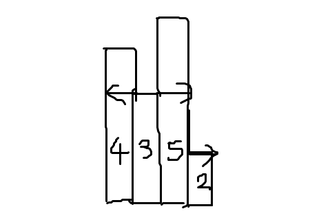

---
categories:
- BOJ
date: '2022-03-16'
title: '[BOJ] 6549 - 히스토그램에서 가장 큰 직사각형'
---


> 플래티넘 V<br>

## 문제
히스토그램은 직사각형 여러 개가 아래쪽으로 정렬되어 있는 도형이다. 각 직사각형은 같은 너비를 가지고 있지만, 높이는 서로 다를 수도 있다. 예를 들어, 왼쪽 그림은 높이가 2, 1, 4, 5, 1, 3, 3이고 너비가 1인 직사각형으로 이루어진 히스토그램이다.


히스토그램에서 가장 넓이가 큰 직사각형을 구하는 프로그램을 작성하시오.

**입력**
입력은 테스트 케이스 여러 개로 이루어져 있다. 각 테스트 케이스는 한 줄로 이루어져 있고, 직사각형의 수 n이 가장 처음으로 주어진다. (1 ≤ n ≤ 100,000) 그 다음 n개의 정수 h1, ..., hn  (0 ≤ hi  ≤ 1,000,000,000)가 주어진다. 이 숫자들은 히스토그램에 있는 직사각형의 높이이며, 왼쪽부터 오른쪽까지 순서대로 주어진다. 모든 직사각형의 너비는 1이고, 입력의 마지막 줄에는 0이 하나 주어진다.

**출력**
각 테스트 케이스에 대해서, 히스토그램에서 가장 넓이가 큰 직사각형의 넓이를 출력한다.

##  해결
가장 높은 막대를 높이로 하는 직사각형이 최대가 될 수 있고, 0을 제외한 가장 낮은 막대를 높이로 하는 직사각형이 최대가 될 수 있다. 또한 모든 막대는 항상 바닥을 접하므로, 가로 길이가 동일한 경우에는 항상 세로 길이가 바닥에 닿아야 넓이가 최대다. 따라서 낮은 길이를 가진 막대를 중점으로 탐색하면 최대가 될 수 있는 직사각형들만 확인할 수 있다.


위의 예시에서 가운데를 시작으로 해서 탐색을 해보자. 막대 (3, 5)를 탐색 출발 위치로 하고 좌우 방향으로 넓혀 나간다. 현재 만들 수 있는 최대 직사각형은 높이가 3이라고 가정하자. 왼쪽부터 진행했을 때, 막대 4에 도달했다면 히스토그램의 끝이므로 왼쪽 탐색은 종료된다. 오른쪽 탐색에선, 막대 2가 3보다 작으므로 탐색을 잠시 멈춘다. 이때 높이 3인 직사각형 넓이는 3×3이고, 최대가 될 수 있다.

다시 탐색을 개시하자. 이번에는 높이 2를 확인할 필요가 있다. 왼쪽은 역시 끝이므로 이동하지 않은 채 탐색 종료고, 오른쪽은 막대 2로 이동한 뒤 끝의 위치에서 탐색이 끝난다. 이때 높이 2인 직사각형 넓이는 2x4이다.

여기서 탐색 시작 위치를 막대 (4, 3), (5, 2)로 할 수도 있다. 비슷한 방법으로 탐색해서 3x2, 2x2를 최대 후보군에 추가할 수 있다. 또 여기서 단일 막대를 높이로 하는 직사각형도 고려할 수 있다. 이처럼 탐색 시작 위치를 기준으로 해서 비슷한 문제로 분할할 수 있으므로 `분할 정복 알고리즘`으로 해결할 수 있다.

> DIV(start, end) = max(area, max(DIV(start, (start + end) / 2), DIV((start + end) / 2 + 1, end)))<br>

분할 함수의 상태는 탐색 범위 (start, end)로 한다. 부분 문제의 계산 값은 해당 히스토그램에서 최대 넓이 직사각형이다.

1. 가운데부터 탐색 시작 => left, right = (start + end) / 2
2. 현재 탐색한 막대 중 최소 높이를 구한다. => min_height = min(H[left], H[right]])
3. 왼쪽 탐색 시작. start에 다다르거나 min_height보다 작은 높이를 만날 때까지 이동.
4. 오른쪽 탐색 시작. end에 다다르거나 min_height보다 작은 높이를 만날 때까지 이동.
5. 넓이 구하기 => area = min_height × (end - start)
6. 최소 높이 갱신 => min_height = min(H[left], H[right]])

최상위 문제의 시간 복잡도는 O(N)이고 문제는 2개씩 분할된다. Recurrence 수식으로 정리하면,
> T(N) = 2T(N/2) + O(N)<br>

이를 recursion tree, master method 등을 사용해 정리하면, 총 시간 복잡도는 O(N log N)이다.

그 외 다른 해결 방법으로 `스택`을 사용할 수 있다. 또한, 분할 정복 알고리즘에서도 다양한 분할 방법으로 접근할 수 있다.

## 코드
```
#include <iostream>
#include <cmath>
using namespace std;

int N;
long long hist[100003];

long long DIV(int start, int end)
{
	if (start > end) return 0;
	if (start == end) return hist[end];
	int lmid = (start + end) / 2;
	int rmid = (start + end) / 2 + 1;
	long long min_height = min(hist[lmid], hist[rmid]);
	long long area = 0;

	while (1)
	{
		while (!(lmid == start || min_height > hist[lmid - 1]))
			lmid--;
		while (!(rmid == end || min_height > hist[rmid + 1]))
			rmid++;
		area = max(area, min_height * (rmid - lmid + 1));

		if (lmid != start && rmid != end) min_height = max(hist[lmid - 1], hist[rmid + 1]);
		else if (lmid != start) min_height = hist[lmid - 1];
		else if (rmid != end) min_height = hist[rmid + 1];
		else break;
	}
	
	return max(area, max(DIV(start, (start + end) / 2), DIV((start + end) / 2 + 1, end)));
}

int main()
{
	while (1)
	{
		scanf("%d", &N);
		if (N == 0) return 0;
		for (int i = 1; i <= N; i++)
			scanf("%lld", &hist[i]);
		printf("%lld\n", DIV(1, N));
	}
}
```

## 링크
<br>https://www.acmicpc.net/problem/6549
