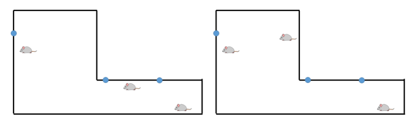

---
categories:
- BOJ
date: '2022-06-26'
title: '[BOJ] 14750 - Jerry and Tom'
---


> 플래티넘 II<br>

## 문제
Naughty mouse Jerry and his friend mice sometimes visit a vacant house to play the famous children game ‘hide and seek’ and also to adjust the length of their teeth by gnawing furniture and chairs left there. If we look down the house from the sky the boundary of it composes an orthogonal polygon parallel to the xy-axes as shown in the figure below. In other words, every wall of the house is either horizontal or vertical.

Tom, a threatening cat to them, sometimes appears in the house while they are enjoying the game. In that case Jerry and his friends should hide into the rat’s holes at the bottom on the walls. There are two rules which must be held for them to hide into the holes:

1.  Each hole can afford at most k mice.
2.  Each mouse can enter the hole which can be seen by it. In other words, a mouse cannot enter the hole which is hidden by any wall. (That is, if the connecting line between a mouse and a hole intersects either any wall or any corner point of the house, the hole is considered hidden from the mouse.)

For example, consider a situation where three mice and three holes are in the house as shown in Figure E.1. Each circle on the boundary denotes a hole. Assuming that k = 1, i.e., only one mouse is allowed to hide into each hole, with the situation shown in the left figure, when Tom appears all the three mice can hide. But for the case shown in the right figure it is impossible for all the mice to hide.



Figure E.1: Illustration to show two situations: 1. All mice can hide (left) and 2. They cannot (right)

You can assume:

1.  Every mouse is strictly inside the house, which means that no mouse is on the wall
2.  Every hole is on the wall.
3.  No two holes locate at the same spot.
4.  No two mice locate at the same spot.

Given a situation explained above, you are to write a program which determines whether all the mice can hide or not.

### 입력
Your program is to read from standard input. The input starts with a line containing four integers, n, k, h, and m, where n(1 ≤ n ≤ 1,000) is the number of the corner points of a house, k(1 ≤ k ≤ 5) the maximum number of mice each hole can afford, h(1 ≤ h ≤ 50) the number of holes, m(1 ≤ m ≤ k ∙ h) the number of mice. In each of the following n lines, each coordinate of the corner points of the house is given in counter clockwise order. Each point is represented by two integers separated by a single space, which are the x- coordinate and the y-coordinate of the point, respectively. Each coordinate is given as an integer between -109  and 109, inclusively. In each of the following h lines, two integers x and y are given, which represent the coordinate (x, y) of each hole. In each of the following m lines, two integers x and y are given, which represent the coordinate (x, y) of each mouse.

### 출력
Your program is to write to standard output. Print exactly one line for the input. Print Possible if all the mice can hide into the rat’s holes holding the constraints explained above. Otherwise print Impossible.

## 해결
쥐가 모두 대피했는지를 판별하는 문제.

일단 벽 충돌 판정은 나중에 하고, 쥐와 쥐구멍에 대해서 먼저 살펴보자. 쥐, 쥐구멍 2개의 집합이 매칭된다는 점에서 `이분 매칭`을 적용할 수 있다. soruce → 쥐 → 쥐구멍 → sink 방향으로 이분 그래프를 생성하자.
```
          X   →   Y
          1       a
          2       b
soruce    3       c    sink
          4       d
          5       e
```
각 쥐구멍은 K의 수용량을 가지고 있으므로 쥐구멍 → sink 간선의 용량은 K이다. 이 점을 제외하고 나머지는 일반적인 이분 매칭 그래프하고 동일하다.

이제 쥐 → 쥐구멍 간선 연결을 판단해보자. 이 간선은 벽 충돌하고 관련이 있다. 쥐 1, 쥐구멍 A을 이은 선분이 벽 선분과 교차하지 않는다면 1 → A 간선을 연결한다. (교차는 꼭지점도 포함된다) 선분 교차 구현은 `CCW`를 사용한 선분 교차 알고리즘을 사용하면 된다.

단, 쥐구멍은 항상 벽에 위치하므로 쥐구멍이 있는 벽과는 항상 시야 충돌이 발생한다. 간선 연결 조건을 교차가 없는 것에서 교차 횟수가 1보다 작은 것으로 바꾸면 이 문제를 해결할 수 있다.
```
|------|
A      |---------|
|     1      2   |
|----------------|
> 1 → A 간선 연결<br>
```

벽의 꼭지점에 쥐구멍이 있는 경우도 처리해보자. 꼭지점에선 시야 충돌이 반드시 2번 발생한다. 쥐구멍이 벽의 꼭지점에 있는 경우는 단순 좌표 비교로 알 수 있으므로, 해당 벽은 교차 판정하지 않고 넘어가면 된다. 따라서 이 경우의 교차 횟수는 최소 0이 된다. 시야가 쥐구멍이 없는 다른 벽과 충돌할 때는 항상 2개 이상의 벽과 충돌하므로 교차 횟수 1회 이하로 연결 조건을 유지해도 문제가 없다.

최종 판정은 모든 쥐가 탈출 성공 여부로 판단할 수 있다. 최대 유량이 M하고 같으면 "Possible"을 출력한다.
```
1. 이분 그래프 생성
	- soruce → 쥐 → 쥐구멍 → sink
	- 쥐구멍 → sink의 용량은 K
2. 쥐 → 쥐구멍 간선 연결
	- 쥐-쥐구멍과 모든 벽 선분 교차 판정
		- 단, 쥐구멍이 벽 꼭지점에 위치하면 해당 벽 비교는 패스
	- 교차 횟수가 1이하면 현재 쥐 → 쥐구멍 간선 연결
3. 최대 유량 계산
	- 최대 유량이 M하고 같으면 "Possible" 출력
```

## 코드
```
#include <iostream>
#include <queue>
#include <memory.h>
#define SIZE 305
using namespace std;
typedef long long ll;
struct Edge { int next, cap, prevIdx; };
int N, K, H, M;
vector<Edge> graph[SIZE];
int level[SIZE], work[SIZE];
int S, T, INF = 1 << 29;

typedef struct Point { int x, y; } Point;
typedef struct Line { Point p1, p2; } Line;
Line home[1002];
Point hole[52];

bool BFS() {
	memset(level, -1, sizeof(level));
	queue <int> q;
	q.push(S);
	level[S] = 0;

	while (!q.empty()) {
		int v = q.front(); q.pop();
		int len = graph[v].size();
		for (int i = 0; i < len; i++) {
			int w = graph[v][i].cap, nv = graph[v][i].next;
			if (level[nv] != -1 || w == 0) continue;

			level[nv] = level[v] + 1;
			q.push(nv);
		}
	}
	return level[T] != -1;
}

int DFS(int v, int flow) {
	if (v == T) return flow;

	int len = graph[v].size();
	for (int& i = work[v]; i < len; i++) {
		int w = graph[v][i].cap, nv = graph[v][i].next, prev = graph[v][i].prevIdx;
		if (w == 0 || level[v] + 1 != level[nv]) continue;

		int nextFlow = DFS(nv, min(flow, w));
		if (nextFlow) {
			graph[v][i].cap -= nextFlow;
			graph[nv][prev].cap += nextFlow;
			return nextFlow;
		}
	}
	return 0;
}

int NetFlow() {
	int sumFlow = 0;
	while (BFS()) {
		memset(work, 0, sizeof(work));
		while (1) {
			int flow = DFS(S, INF);
			if (flow == 0) break;
			sumFlow += flow;
		}
	}
	return sumFlow;
}

void MakeEdge(int a, int b, int w) {
	graph[a].push_back({ b, w, (int)graph[b].size() });
	graph[b].push_back({ a, 0, (int)graph[a].size() - 1 });
}

bool PointEqual(Point p1, Point p2) {
	return (p1.x == p2.x) && (p1.y == p2.y);
}

int CCW(Point a, Point b, Point c) {
	ll D = ((ll)b.x - a.x) * ((ll)c.y - a.y) - ((ll)c.x - a.x) * ((ll)b.y - a.y);
	return (D == 0) ? 0 : ((D > 0) ? 1 : -1);
}

bool Intersect(Point p1, Point p2, Point p3, Point p4) {
	int r1 = CCW(p1, p2, p3), r2 = CCW(p1, p2, p4);
	int r3 = CCW(p3, p4, p1), r4 = CCW(p3, p4, p2);
	bool res;

	if (r1 == 0 || r2 == 0 || r3 == 0 || r4 == 0) {
		if (r1 == 0 && r2 == 0 && r3 == 0 && r4 == 0) {
			int ranx1 = min(p1.x, p2.x), ranx2 = max(p1.x, p2.x);
			int rany1 = min(p1.y, p2.y), rany2 = max(p1.y, p2.y);
			int ranx3 = min(p3.x, p4.x), ranx4 = max(p3.x, p4.x);
			int rany3 = min(p3.y, p4.y), rany4 = max(p3.y, p4.y);
			res = (p3.x >= ranx1 && p3.x <= ranx2 && p3.y >= rany1 && p3.y <= rany2) ||
				(p4.x >= ranx1 && p4.x <= ranx2 && p4.y >= rany1 && p4.y <= rany2) ||
				(p1.x >= ranx3 && p1.x <= ranx4 && p1.y >= rany3 && p1.y <= rany4) ||
				(p2.x >= ranx3 && p2.x <= ranx4 && p2.y >= rany3 && p2.y <= rany4);
		}
		else {
			if ((p1.x == p3.x && p1.y == p3.y) || (p1.x == p4.x && p1.y == p4.y) ||
				(p2.x == p3.x && p2.y == p3.y) || (p2.x == p4.x && p2.y == p4.y)) res = 1;
			else res = r1 != r2 && r3 != r4;
		}
	}
	else res = r1 != r2 && r3 != r4;
	return res;
}

int main() {
	ios_base::sync_with_stdio(false); cin.tie(NULL); cout.tie(NULL);
	cin >> N >> K >> H >> M;
	S = M + H, T = M + H + 1;
	Point p1, p2, p0;
	cin >> p1.x >> p1.y;
	p0 = p1;
	for (int i = 0; i < N - 1; i++) {
		cin >> p2.x >> p2.y;
		home[i] = { p1, p2 };
		p1 = p2;
	}
	home[N - 1] = { p2, p0 };

	for (int h = 0; h < H; h++) {
		cin >> hole[h].x >> hole[h].y;
		MakeEdge(M + h, T, K);
	}
	for (int m = 0; m < M; m++) {
		Point mouse;
		cin >> mouse.x >> mouse.y;
		MakeEdge(S, m, 1);
		for (int h = 0; h < H; h++) {
			int crs = 0;
			for (int i = 0; i < N; i++)
				if (!(PointEqual(hole[h], home[i].p1) || PointEqual(hole[h], home[i].p2)))
					if (Intersect(mouse, hole[h], home[i].p1, home[i].p2))
						crs++;
			if (crs <= 1)
				MakeEdge(m, M + h, 1);
		}
	}

	if (M == NetFlow()) cout << "Possible";
	else cout << "Impossible";
	return 0;
}
```

## 링크
<br>https://www.acmicpc.net/problem/14750
