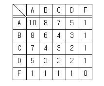
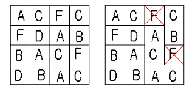

---
categories:
- BOJ
date: '2022-06-27'
title: '[BOJ] 11111 - 두부장수 장홍준 2'
---


> 플래티넘 II<br>

## 문제
장홍준은 참 특이한 두부장수이다. 세로크기 N, 가로크기 M인 두부판을 가지고 2x1짜리 두부로 잘라서 판다. 그런데, 두부판의 위치마다 등급이 다르다. 그리고 2x1짜리에 등급이 어떻게 매겨지느냐에 따라 두부의 값도 천차만별이 된다. 다음 등급표를 보자.



위의 표는 2x1짜리 두부의 등급에 따라 매겨지는 두부의 가격표다. 예를 들어 “AC" 두부의 가격은 7이고, ”DB" 두부의 가격은 3이다.

세로크기 M, 가로크기 N의 두부판이 주어진다. 각 칸마다 두부의 등급이 A, B, C, D, F로 매겨져 있다. 홍준이는 전체 두부가격의 합을 최대가 되게 두부를 자르려고 한다. 2x1짜리 두부로 잘라내고 남은 한 칸짜리 두부는 가격이 0이기 때문에 버린다. 홍준이를 도와 가격이 최대가 되게 두부판을 자르는 프로그램을 작성하시오.



위 그림은 N=4, M=4 인 두부판의 한 예이다. 오른쪽 그림이 잘라낸 두부가격의 합을 최대로 한 것이다. 한 칸짜리는 쓸모없으므로 버린다.

### 입력
첫째 줄에는 두부판의 세로크기 N, 가로크기 M이 주어진다. N, M은 1이상 50이하의 정수이다. 그 다음 N줄에 걸쳐 M개의 문자가 주어진다. 각 문자는 그 칸의 두부의 등급을 나타내며 A, B, C, D, F 중 하나로 주어진다.

### 출력
첫째 줄에 잘라낸 두부가격 합의 최댓값을 출력한다.

## 해결
> 11495 - 격자 0 만들기 + MCMF<br>

`11495 - 격자 0 만들기`처럼 `최대 유량`으로 모델링이 가능한 문제. 대신 이 문제는 최대 비용을 구한다. `MCMF` 알고리즘에서 간선 비용을 음수로 주면 최대 비용을 알 수 있다.

인접한 2개의 두부가 매칭된다. 이는 `이분 매칭`과 비슷하다. 즉, source 쪽에 두부 1개, sink 쪽에 인접한 두부 1개를 연결한 이분 그래프를 만들 수 있다.
```
O = 짝수 두부
X = 홀수 두부
ex.
O X O
X O X
O X O
```
source 1개, sink 1개, 짝수 칸 정점과 간선, 홀수 칸 정점과 간선, 짝수 정점과 홀수 정점을 연결하는 간선으로 이분 매칭 그래프를 만들면 된다. 일반적인 이분 매칭 그래프와 비슷하며 여기서 가중치가 추가되었다.
- source → 짝수 칸:  가중치 = 0, 용량 = 1
- 홀수 칸 → sink:  가중치 = 0, 용량 = 1
- 짝수 칸 → 홀수 칸:  가중치 = 2개의 두부 등급(위에 있는 등급표에서 구함), 용량 = 1
	- 짝수 칸에서 인접한 홀수 칸 방향으로 연결하는 간선을 준비한다.
	- 현재 짝수 칸이 (x, y)이면 연결되는 홀수 칸은 (x + 1, y), (x - 1, y), (x, y + 1), (x, y - 1)이다.

단, 예외가 존재한다. 서로 인접하지 않은 홀수 두부 1개와 짝수 두부 1개가 마지막으로 남았을 때, 마치 역류처럼 역방향 간선을 타고 유량이 흘러가 최종 답이 작아지게 하는 값이 더해지는 문제가 있다. (역방향 간선은 반대 부호의 가중치를 가지고 있기 때문) 문제 설명문에 있는 예제가 이 예외에 해당된다.

이 예외는 짝수 칸 → sink (가중치 = 0, 용량 = 1) 간선도 추가로 연결해주면 해결할 수 있다. 최단거리 알고리즘에서 역방향 간선을 선택하지 않고 sink 방향 간선을 선택하므로 역류가 발생하지 않는다.

최종적으로 그래프에서 `MCMF`를 수행하면 정답이 출력된다.

## 코드
```
#include <iostream>
#include <queue>
#include <memory.h>
#define SIZE 2505
using namespace std;
typedef long long ll;
const int INF = (1 << 30) - 1;
struct Edge { int dest, weight, cap, prevIdx; };
int N, M, S, T;
ll dist[SIZE];
bool inQ[SIZE];
int trc_v[SIZE], trc_idx[SIZE];
vector<Edge> graph[SIZE];<br>

int tofu[52][52];
const int RANK[5][5] = {
	10, 8, 7, 5, 1,
	8, 6, 4, 3, 1,
	7, 4, 3, 2, 1,
	5, 3, 2, 2, 1,
	1, 1, 1, 1, 0
};

bool SPFA() {
	memset(inQ, 0, sizeof(inQ));
	for (int i = 0; i < SIZE; i++) dist[i] = INF;
	queue <int> q;<br>
	q.push(S), dist[S] = 0, inQ[S] = 1;

	while (!q.empty()) {
		int v = q.front(); q.pop();
		inQ[v] = 0;
		for (int i = 0; i < graph[v].size(); i++) {
			if (graph[v][i].cap == 0) continue;
			int nv = graph[v][i].dest, w = graph[v][i].weight;

			if (dist[nv] > dist[v] + w) {<br>
				dist[nv] = dist[v] + w;
				trc_v[nv] = v, trc_idx[nv] = i;

				if (!inQ[nv]) {
					q.push(nv);
					inQ[nv] = 1;
				}
			}
		}
	}
	return dist[T] != INF;
}

void NetFlow() {
	int sumWeight = 0;
	while (SPFA()) {
		int minFlow = INF;
		for (int v = T; v != S; v = trc_v[v])
			minFlow = min(minFlow, graph[trc_v[v]][trc_idx[v]].cap);

		for (int v = T; v != S; v = trc_v[v]) {
			int pv = trc_v[v], pidx = trc_idx[v];
			graph[pv][pidx].cap -= minFlow;
			graph[v][graph[pv][pidx].prevIdx].cap += minFlow;
			sumWeight += minFlow * graph[pv][pidx].weight;
		}
	}
	cout << -sumWeight;
}

void MakeEdge(int a, int b, int w, int c) {
	graph[a].push_back({ b, w, c, (int)graph[b].size() });
	graph[b].push_back({ a, -w, 0, (int)graph[a].size() - 1 });
}

int dx[4] = { 1, 0, -1, 0 };
int dy[4] = { 0, 1, 0, -1 };
void Connect(int x, int y) {
	if ((y + x) % 2 != 0) return;
	for (int d = 0; d < 4; d++) {
		int nx = x + dx[d], ny = y + dy[d];
		if (nx < 0 || nx >= M || ny < 0 || ny >= N) continue;
		MakeEdge(y * M + x, ny * M + nx, -RANK[tofu[y][x]][tofu[ny][nx]], 1);
	}
}

int Converter(char c) {
	switch (c) {
	case 'A': return 0;
	case 'B': return 1;
	case 'C': return 2;
	case 'D': return 3;
	case 'F': return 4;
	}
	return 0;
}

int main() {
	ios_base::sync_with_stdio(false); cin.tie(NULL); cout.tie(NULL);
	cin >> N >> M;<br>
	S = N * M, T = N * M + 1;
	for (int y = 0; y < N; y++) {
		for (int x = 0; x < M; x++) {
			char c;
			cin >> c;<br>
			tofu[y][x] = Converter(c);
			if ((y + x) % 2 == 0) MakeEdge(S, y * M + x, 0, 1);
			MakeEdge(y * M + x, T, 0, 1);
		}
	}
	for (int y = 0; y < N; y++)
		for (int x = 0; x < M; x++)
			Connect(x, y);

	NetFlow();
	return 0;
}
```

## 링크
https://www.acmicpc.net/problem/11111<br>

## 비슷한 문제
https://www.acmicpc.net/problem/1657<br>
