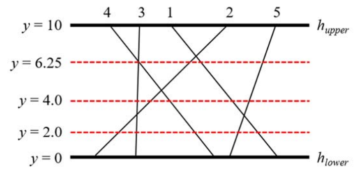

---
categories:
- BOJ
date: '2022-07-30'
title: '[BOJ] 14751 - Leftmost Segment'
---


> 플래티넘 I<br>

## 문제
There are two distinct horizontal lines hupper  and hlower  in the xy-coordinate plane and n line segments connecting them. One endpoint of each segment lies on hupper  and the other on hlower. All endpoints of the segments are distinct. All segments are numbered from 1 to n. Consider a horizontal line hi  located between hupper  and hlower, which will be given by a query. The line hi  crosses all segments definitely. We want to know which segment intersects at the leftmost with hi. You can observe that the leftmost intersection point between the segments and a query line may lie on one or more segments since two or more segments may intersect at a single point. In that case, the leftmost segment is defined as the segment which has the leftmost endpoint on hupper.

For example, 5 segments and 3 query lines are given in the plane as shown in the figure below. The leftmost segment that intersects with a query line of y = 2.0 is 2 and the leftmost segment that intersects with a query line of y = 4.0 is 3. The query line of y = 6.25 crosses the intersection point between the segments 3 and 4, hence the leftmost segment is 4 by definition.



Given n segments connecting two horizontal lines and m queries, you are to write a program to find the leftmost segment that intersects with each query line.

Note that two or more segments may intersect at a single point. You should be also careful of round-off errors caused by the computer representation of real numbers.

### 입력
Your program is to read from standard input. The input starts with a line containing two integers, maxY and minY (-1,000 ≤ minY < maxY ≤ 1,000), where maxY and minY represent the y-coordinates of the upper horizontal line and the lower horizontal line, respectively. The next line contains an integer n (1 ≤ n ≤ 100,000) which is the number of segments connecting two horizontal lines. All segments are numbered from 1 to n in order given as the input. In the following n lines, each line contains two integers upperX and lowX (-500,000 ≤ upperX, lowX ≤ 500,000) which represent the x-coordinates of the upper endpoint and the lower endpoint of a line segment, respectively. All endpoints are distinct. The next line contains an integer m (1 ≤ m ≤ 100,000) which is the number of queries. In the following m lines, each line contains a y-coordinate given for the query horizontal line, which is a real number between minY and maxY exclusive and the number of digits after the decimal point is 1 or more and 3 or less.

### 출력
Your program is to write to standard output. Print exactly one line for each query in order given as the input. The line should contain the leftmost segment number which intersects with the query horizontal line.

## 해결
y = a 선분과 교차하는 점 중에서 가장 왼쪽에 있는 조각 선분을 찾는 쿼리를 해결하는 문제. 위의 예제 그림에서는 3번 조각과 4번 조각이 쿼리 답의 후보가 된다. 

문제 그림을 오른쪽으로 90도 돌리고 상하 반전을 하면 쿼리를 다음과 같은 식으로 바꿀 수 있다.
> Q(x) = min(x × a<sub>i</sub> + b<sub>i</sub>) (i = [0, n - 1])<br>

이는 `Convex Hull Trick`의 기본 형태와 유사하다. 따라서 컨벡스 헐 트릭의 자료 구조를 가져와서 적용하면 된다.

**< 유의 사항 >**
- 조각 선분 f(x)은 무작위로 입력된다.
	- 스택에 추가하기 전에 기울기 내림차순으로 정렬한다.
- 쿼리의 답은 조각 선분 f(x)의 id(=입력받은 순서대로 배정된 번호)이며, 한 교점에 여러 선분이 있다면 f(maxX)이 작은 것을 고른다.
	- `이분 탐색`에서 교점 위치에 x가 있다면 f(x)의 기울기가 작은 것을 선택하면 된다.
- 기울기가 같은 조각 선분 f(x)이 존재할 수 있다.
	- 스택에 추가할 때 입력 선분과 스택의 top 선분의 기울기가 동일하면 y절편이 작은 것을 선택한다.
	- 이때 입력 선분이 스택에 들어오면 컨벡스 헐 탐색을 수행한다.
- 실수 equal 비교 연산이 필요하다.
	- 연산자 ==이 아닌 오차로 비교

## 코드
```
#include <iostream>
#include <algorithm>
#include <cmath>
using namespace std;
typedef long long ll;
struct Line { double a, b; int id; }; // y = ax + b
const int SIZE = 1e5 + 2;
const double EPS = 1e-6;
int N, M;
ll minX, maxX;
Line line[SIZE];
bool cmp(Line a, Line b) { return a.a > b.a; }<br>
bool Equal(double a, double b) { return abs(a - b) < EPS; }

struct CHT {
	int size = 0;
	Line stk[SIZE];

	double Cross(int L1, int L2) {
		return (double)(stk[L1].b - stk[L2].b) / (stk[L2].a - stk[L1].a);
	}

	void Insert(Line v) {
		if (size < 1) {
			stk[size++] = v;
			return;
		}
		if (Equal(v.a, stk[size - 1].a)) {
			if (v.b < stk[size - 1].b)
				size--;
			else
				return;
		}
		
		stk[size] = v;
		while (1 < size && Cross(size - 2, size - 1) > Cross(size - 1, size)) {<br>
			stk[size - 1] = stk[size];
			size--;
		}
		size++;
	}

	bool Scan(int mid, double x) {
		double c = Cross(mid, mid + 1);
		return (!Equal(c, x)) ? c < x : stk[mid].a > stk[mid + 1].a;<br>
	}

	int Search(double x) {
		int lo = 0, hi = size - 1;
		while (lo < hi) {
			int mid = (lo + hi) / 2;
			if (Scan(mid, x))
				lo = mid + 1;
			else hi = mid;
		}
		return stk[lo].id;
	}
};
CHT cht;

int main() {
	ios_base::sync_with_stdio(false); cin.tie(NULL); cout.tie(NULL);
	cin >> maxX >> minX >> N;<br>
	for (int i = 0; i < N; i++) {
		double y1, y2, d;
		cin >> y2 >> y1;<br>
		d = (y2 - y1) / (maxX - minX);
		line[i] = { d, -d * minX + y1, i + 1 };
	}

	sort(line, line + N, cmp);
	for (int i = 0; i < N; i++)
		cht.Insert(line[i]);

	cin >> M;<br>
	for (int i = 0; i < M; i++) {
		double x;
		cin >> x;<br>
		cout << cht.Search(x) << "\n";
	}
	return 0;
}
```

## 링크
https://www.acmicpc.net/problem/14751
